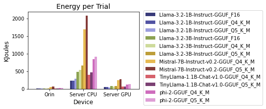
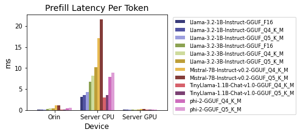
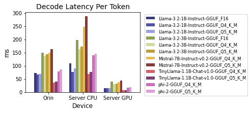
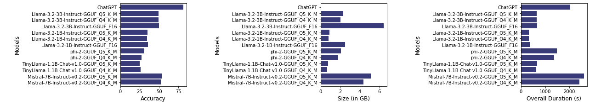
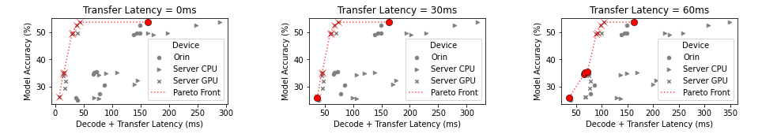

# LLM Edge-Continuum Inference Analysis

This repository contains the analysis artifact for the paper **A Measurement
Study of LLM Inference Trade-offs Across Edge-Continuum Hardware**. It compares
LLM deployments across edge and server platforms using accuracy, model size,
execution time, token latency, and system energy measurements.

The analysis is implemented in [`Analysis.ipynb`](Analysis.ipynb). The notebook
loads the supplied CSV files, produces the plots shown below, and evaluates
accuracy-latency Pareto frontiers under different server-side transfer-latency
assumptions.

## Repository Contents

```text
.
├── Analysis.ipynb
├── README.md
├── requirements.txt
├── data
│   ├── results.csv
│   └── results_chatgpt.csv
└── figures
    ├── energy_per_trial.png
    ├── prefill_latency_per_token.png
    ├── decode_latency_per_token.png
    ├── orin_cloud_accuracy.png
    ├── orin_cloud_model_size.png
    ├── orin_cloud_duration.png
    ├── pareto_frontier_0ms.png
    ├── pareto_frontier_30ms.png
    ├── pareto_frontier_60ms.png
    ├── orin_cloud_accuracy_size_duration.png
    └── pareto_frontiers.png
```

## Data

- `data/results.csv` contains 36 self-hosted measurements covering Orin,
  Server CPU, and Server GPU deployments.
- `data/results_chatgpt.csv` contains the cloud-hosted ChatGPT reference
  measurement used in the accuracy, model-size, and duration comparisons.

The cloud result is not included in the energy plots or self-hosted Pareto
analysis because equivalent hardware-level measurements are not available.

## Analysis

The notebook performs the following steps:

1. Compares mean system energy per trial across devices and models.
2. Compares prefill and decode latency per token.
3. Compares Orin models with the cloud reference by accuracy, model size, and
   overall duration.
4. Finds non-dominated self-hosted configurations that minimize decode latency
   while maximizing accuracy.
5. Recomputes the Pareto frontier after adding 30 ms and 60 ms of effective
   per-token transfer latency to server deployments.

## Setup and Execution

Run the notebook from the repository root because its data paths are relative
to that directory.

```bash
python -m venv .venv
source .venv/bin/activate
pip install -r requirements.txt
jupyter lab Analysis.ipynb
```

The notebook already contains executed outputs. Re-running all cells reproduces
the analysis from the CSV files.

## Figures

The nine individual PNG files in `figures/` are exported from the
corresponding outputs embedded in `Analysis.ipynb`. The two overview images
assemble related notebook outputs side by side without changing their plots.

### Energy per trial



### Prefill latency per token



### Decode latency per token



### Orin and cloud comparison



The individual panels are also available as
`orin_cloud_accuracy.png`, `orin_cloud_model_size.png`, and
`orin_cloud_duration.png`.

### Accuracy-latency Pareto frontiers



The individual scenarios are also available as `pareto_frontier_0ms.png`,
`pareto_frontier_30ms.png`, and `pareto_frontier_60ms.png`.

## Reproducibility Notes

- Accuracy is displayed as a percentage in the comparison and Pareto plots.
- Energy is aggregated by device and model and converted from joules to
  kilojoules.
- Lower latency and higher accuracy are preferred in the Pareto analysis.
- The 30 ms and 60 ms sensitivity scenarios add transfer latency only to
  Server CPU and Server GPU measurements.
